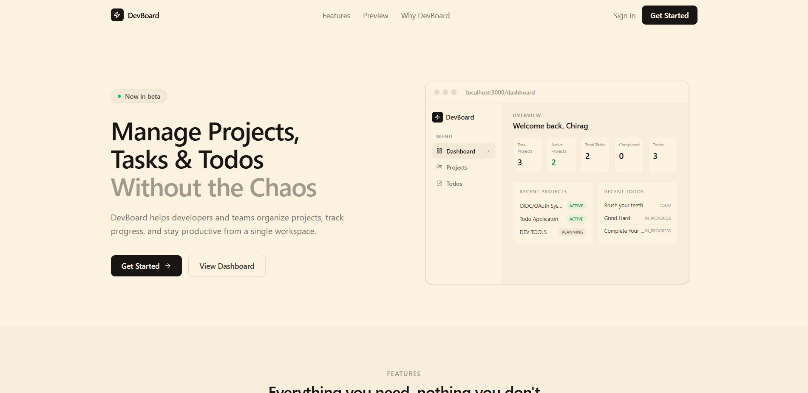
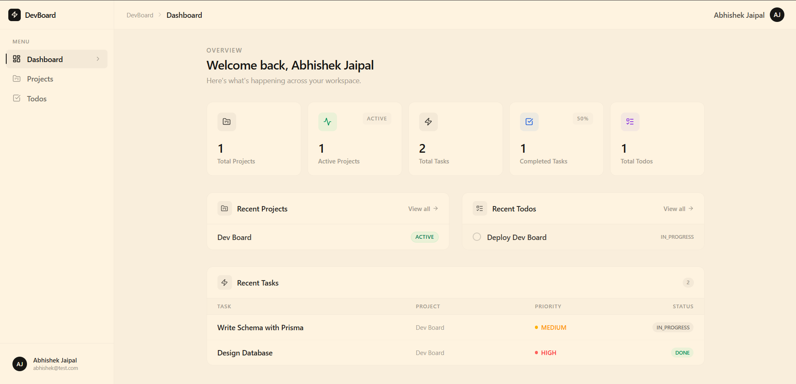
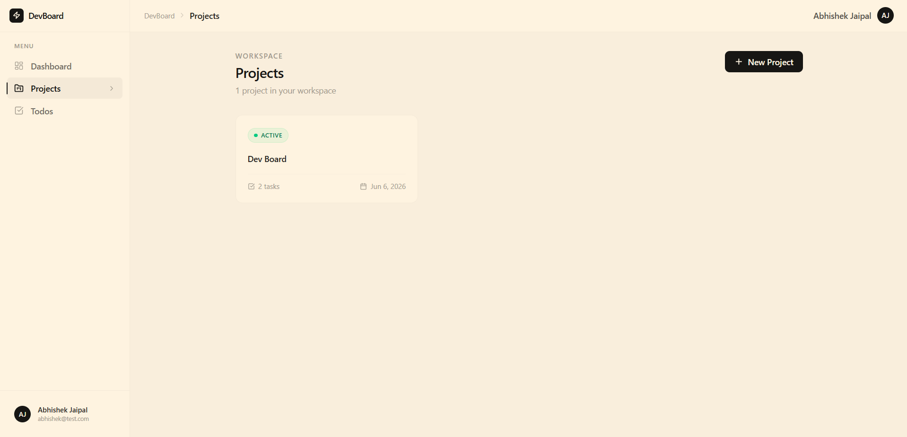
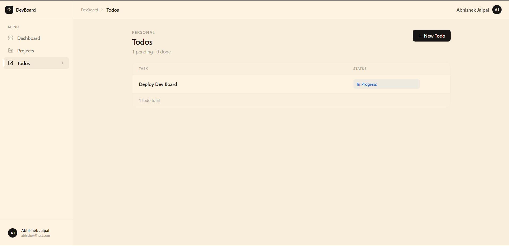
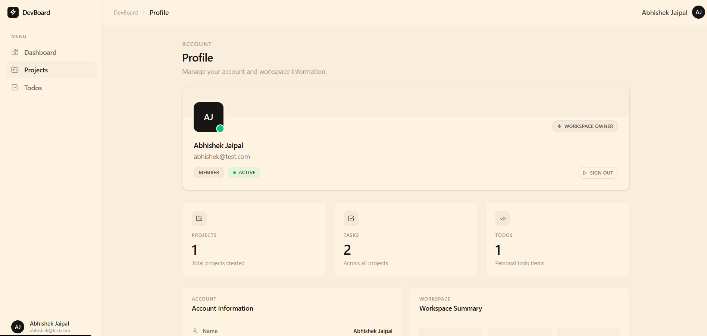

# DevBoard

A modern project management platform built with Next.js that helps developers and teams organize projects, track tasks, and manage personal todos from a single workspace.

DevBoard combines project tracking, task management, and personal productivity tools into one clean and responsive dashboard. Each user has a secure workspace where their projects, tasks, and todos remain completely isolated from other users.

---

## Features

### Authentication

- Secure user registration and login
- Credential-based authentication using Auth.js
- Protected dashboard routes
- Session management
- User-specific data access

### Dashboard

- Personalized dashboard overview
- Project statistics
- Task statistics
- Todo statistics
- Recent activity sections

### Project Management

- Create new projects
- View project details
- Track project status
- Organize project-related tasks
- Project ownership and access control

### Task Management

- Create tasks within projects
- Track task progress
- Update task status
- Task prioritization
- View tasks by project

### Personal Todos

- Create personal todo items
- Track completion status
- Manage independent tasks outside projects
- Quick productivity workflow

### User Profile

- Profile overview
- Workspace statistics
- Account information
- User activity summary

### User Experience

- Responsive dashboard layout
- Loading states
- Error boundaries
- Custom 404 pages
- Clean and modern interface
- Mobile-friendly navigation

---

## Tech Stack

### Frontend

- Next.js 16
- React 19
- TypeScript
- Tailwind CSS
- Lucide React Icons

### Backend

- Next.js Server Components
- Server Actions
- Route Handlers

### Authentication

- Auth.js (NextAuth v5)

### Database

- PostgreSQL
- Neon Database

### ORM

- Prisma ORM

### Validation

- Zod

### Package Manager

- Bun

---

## Application Architecture

DevBoard follows a full-stack architecture using the Next.js App Router.

### Structure

```
app/
├── (auth)/
├── actions/
├── dashboard/
├── api/
├── error.tsx
├── not-found.tsx
├── page.tsx
└── layout.tsx

components/
├── auth/
├── dashboard/
├── projects/
├── tasks/
└── todos/

lib/
├── services/
├── db.ts
└── auth.ts

prisma/
└── schema.prisma

schema/

types/
```

### Key Design Decisions

- Server Components for data fetching
- Server Actions for mutations
- Prisma for type-safe database access
- Auth.js for authentication and session handling
- Route protection at the application level
- User data isolation through ownership checks
- Reusable service layer for business logic

---

## Database Models

### User

Stores account information and authentication data.

### Project

Represents a user's project workspace.

### Task

Represents work items associated with projects.

### Todo

Represents personal tasks outside project workflows.

Relationships:

```
User
├── Projects
│ └── Tasks
└── Todos
```

---

## Getting Started

### Prerequisites

- Node.js 22+ or Bun
- PostgreSQL database
- Neon account (recommended)

### Installation

Clone the repository:

```bash
git clone <repository-url>
cd devboard
```

Install dependencies:

```bash
bun install
```

---

## Environment Variables

Create a `.env` file in the project root:

```env
DATABASE_URL="your_database_url"
AUTH_SECRET="your_auth_secret"
AUTH_URL="http://localhost:3000"
```

---

## Database Setup

Generate Prisma Client:

```bash
bunx prisma generate
```

Run database migrations:

```bash
bunx prisma migrate deploy
```

For development:

```bash
bunx prisma migrate dev
```

---

## Running Locally

Development mode:

```bash
bun run dev
```

Application will be available at:

```text
http://localhost:3000
```

---

## Production Build

Build the application:

```bash
bun run build
```

Start production server:

```bash
bun run start
```

---

## Screenshots

### Landing Page



### Dashboard



### Projects



### Todos



### Profile



---

## Learning Outcomes

This project was built to strengthen understanding of:

- Full-stack application architecture
- Authentication and authorization
- Database design and relationships
- Server Components
- Server Actions
- Type-safe database access with Prisma
- Production-ready error handling
- Route protection
- User-specific data isolation
- Responsive UI development

---

## Future Improvements

- Due dates and reminders
- Search functionality
- Advanced filtering
- Drag-and-drop Kanban board
- Team collaboration
- Notifications
- Activity logs
- File attachments
- Dark mode

---

## Author

Chirag Jaipal

Computer Science Engineering Student

Built as part of a full-stack learning journey focused on modern web development using Next.js, TypeScript, Prisma, PostgreSQL, and Auth.js.
